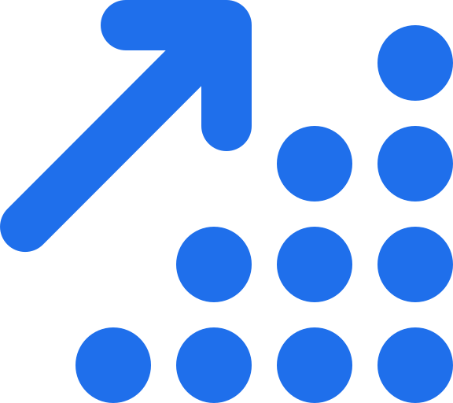

# Hi there! Ali Homany here 😄

A random dude with some passion, a bit of discipline, a sprinkle of creativity and a lot of curiousity.

👨‍💻 enjoys building projects (it is the best way to learn:) trying to solve problems and create useful tools.

👌 always strives to keep his code clean, efficient, and user-friendly.

&nbsp; always looking to expand his skill set. Currently diving deeper into backend while continuing his last uni year!
